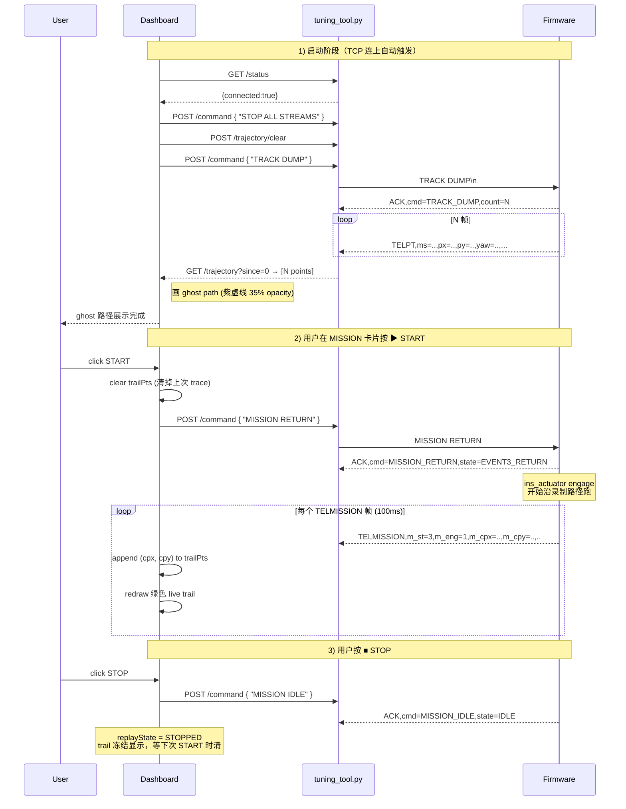

# Dashboard Redesign — Cyberpunk HUD

**日期**：2026-05-22
**改动对象**：`E:\ads\tcp_tool\dashboard.html` + `E:\ads\tcp_tool\config.json` 的 UI 字段
**不动**：`tuning_tool.py`（TCP↔HTTP 桥）、PyInstaller 打包流程、TCP 协议
**Firmware 前置硬性要求**（实车使用前必须落地，详见 §5）：在 `code/ICM42688/ins_mission.c` 新增 3 道闸门（Gate 6 TCP 断 / Gate 7 CPU1 卡 / Gate 8 心跳超时），实车上 dashboard 改造前**必须先完成此 firmware 变更**才可上车。

---

## 1. 目标

把当前 4137 行 dashboard 的右侧 7 个 Tab + 顶部 4 卡片 + 底部命令行精简到：

- **左**：单一大画布，可在 **时序图 ↔ 轨迹 XY** 两种模式之间切换
- **右**：两段叠放面板 — **Subscribe**（流订阅）+ **Display**（订阅流的实时字段）
- **底**：保留 console 滚动日志
- **MISSION 流**的复现调参（KP / CAP / LA / BLEND + START / STOP）**内嵌在 MISSION 卡片**里，没订阅 MISSION 就不出现

整体视觉换成 **Cyberpunk HUD** 调子：暗夜底 + 高饱和霓虹色 + 细网格 + 数字发光 + 角落 bracket。

---

## 2. 设计决策（含已选）

| 决策 | 选项 | 选定 |
|---|---|---|
| 订阅颗粒度 | 流级别 / 字段级别 / 混合 | **流级别**：勾流后该流所有字段都进 Display + 数值字段全部进 chart |
| 整体布局 | 3 Tab / 3 段叠放 / Chart↔Trajectory swap | **Chart↔Trajectory swap**：左侧大画布两种模式 |
| 右侧组织 | 3 段常驻 / 2 段嵌入 / Subscribe+Tab | **2 段叠放（Tuning 嵌入 Display）**：Subscribe + Display，MISSION 卡顶部内嵌 tuning |
| 字段渲染 | 紧凑行 / 值卡+spark / 横行 spark | **横行 spark**：label / 横向 sparkline / value 一行排开 |
| 视觉方向 | Apple glass / Linear / Tactical / Cyberpunk HUD | **Cyberpunk HUD** |
| 现有 chrome | metrics bar / cmd 输入 / console / 按钮行 | 保留 console + 新增 START/STOP 按钮；其它砍 |

---

## 3. 总体布局

```
┌──────────────────────────────────────────────────────────────────┐
│ HEADER  SMARTCAR · TUNING            ● LINK  RX/TX   [bracket]   │   54px
├──────────────────────────────────────────┬───────────────────────┤
│                                          │ ◤ SUBSCRIBE 2/10      │
│   [TIME-SERIES] [TRAJECTORY XY]          │ [TURN][MISSION] ...   │
│   ●LIVE t=312.4s · 1.0×                  ├───────────────────────┤
│                                          │ ◤ DISPLAY             │   1fr
│   ┌────[ chart canvas ]────────┐         │ ┌──MISSION─EVENT1────┐│
│   │ grid + bracket corners      │         │ │ ▸ REPLAY TUNING    ││
│   │ subscribed numeric chans    │  legend │ │   KP/CAP/LA/BLD    ││
│   │ glowing curves + end dots   │         │ │   ▶ START  ■ STOP  ││
│   │                             │         │ │   m_xte/m_yer/...  ││
│   └─────────────────────────────┘         │ ├──TURN─────────────┐││
│                                          │ │ t_tgt/t_cur/t_err  ││
│                                          │ │ t_en[ON] t_kp ...  ││
├──────────────────────────────────────────┴───────────────────────┤
│ CONSOLE [12:08:23] › ACK,cmd=...                                  │   78px
│         [12:08:23] › TELTURN,t_tgt=12.5,...                       │
└──────────────────────────────────────────────────────────────────┘
```

CSS Grid：
```
#app {
  grid-template-rows:    54px 1fr 78px;       /* header / main / console */
  grid-template-columns: 1fr 280px;           /* chart / right-panels */
}
```

（旧版有 `metrics-h 130px` + `console-h 110px` 两行，现在 metrics 行去掉、console 缩到 78px。旧版右列 350px，新版收到 280px 因为内容更紧凑。）

---

## 4. 组件规格

### 4.1 Header

- 左：SMARTCAR · TUNING（渐变文字 cyan→blue→purple，letter-spacing 3px）
- 紧邻 sub-tag：`REV-xxxx / SONNET / YYYY-MM-DD`（mono 9px mute）
- 右：状态群
  - `● LINK · 192.168.137.1:8080` 绿色脉冲点
  - `RX 12.4 KB/s` chip + `TX 0.8 KB/s` chip（青绿边框 + 微透明青背）
- 右上角：14×14 bracket cut 装饰

### 4.2 Chart 区（左）

**Toolbar**：
- Mode tabs（左）：`▸ TIME-SERIES` / `▸ TRAJECTORY XY`，active 态青绿描边 + 内外发光
- Zoom group（中）：`−` / `+` / `⟲ RESET` 三个按钮 + `1.0×` 实时倍率 label。zoom 范围 [1.0×, 10.0×]，步长 1.25×；RESET = 倍率回 1.0× + 跳回 LIVE
- 右：`● LIVE` / `⏸ PAUSED` 状态 + `t=312.4s · 60 fps`（live 点磷绿脉冲；pan 后变琥珀 PAUSED）
- Trajectory 模式时 Toolbar 右侧追加 `FIT` / `SAVE` / `LOAD` 三按钮

**Canvas**：
- 背景渐变 + 60×40 内部网格（cyan 0.14 透明度）
- 四角 bracket（16px 折角，cyan + drop-shadow 4px glow）
- Channel 曲线：每条配 `filter: drop-shadow(0 0 4px currentColor)`；最后一点画一个 3px 实心点（发光更强）作为"心跳"，仅在 LIVE 状态下显示
- 右上 legend（mono 10px，每条 14×2px 色块）
- cursor: crosshair（默认）/ grabbing（拖动 pan 时）

**缩放与平移**：
- 长缓冲：每个数值字段独立 ring buffer，容量 = `CHART_N = 1800`（≈ 30s @ 60fps）
- 显示窗口大小 = `CHART_N / zoomLevel`（zoom 1× = 全部 30s；zoom 10× = 3s）
- Pan 偏移 = `panOffset`（单位：buffer 点数；0 = LIVE，>0 = 滚回过去）
- 鼠标滚轮：在 chart 区域 wheel up 放大、wheel down 缩小（passive: false 防止页面滚）
- 拖拽 pan：在 chart 区域按住左键拖，向右拖 = 往过去看（panOffset 增加），向左拖 = 往现在看（封顶为 LIVE）
- LIVE / PAUSED 切换：`panOffset == 0` 且 `zoomLevel == 1.0` ⇒ LIVE（自动跟最新数据滚屏）；其它⇒ PAUSED（窗口固定，新数据进 buffer 不影响视图）
- `RESET` 按钮 / 拖到 panOffset==0 即恢复 LIVE

**Minimap（chart canvas 下方，38px 高）**：
- 整段 buffer 的压缩 sparkline（参考字段：优先 t_cur，fallback t_tgt → m_xte → 任一数值字段）
- 半透明青绿 area fill + 1px 描边 + 微 glow
- 可拖动 viewport 矩形（青绿 1px 描边 + 双侧把手 +「内透青绿 10%」+ outer glow）
- 交互：
  - 在 viewport 上按住左键拖 → 等价于在主图 pan
  - 在 minimap 空白处单击 → viewport 中心 snap 到该位置
- 右上角 `● LIVE` / `⏸ PAUSED` 小 tag（与 toolbar 状态同步）

**两种模式**：
- **Time-series**：按当前 `mainChart` canvas 渲染，channels = 所有订阅流的数值字段并集；minimap 显示参考字段全段
- **Trajectory XY**：复用现成 `trajectory-overlay` 的 `drawTrajectory` 等代码，但渲染到 `mainChart` 画布上（不再做全屏 overlay）。Trajectory 模式下 zoom + pan 按钮仍可见，但语义换成 XY 缩放 + 平移（用 SVG `viewBox` 实现）；minimap 隐藏
- 切到 Trajectory 时若 MISSION 未订阅 → 画布中央显示 "Subscribe MISSION to see trajectory"

### 4.3 Subscribe 面板（右上）

- 标题：`◤ SUBSCRIBE  N/10 ACTIVE`（mono 10px cyan + glow）
- 10 个流 chip：`TURN / DRIVE / MISSION / YAW / INS / ODOM / INSENC / TUNE / LOOKA / STATS`
- 未激活：`border: 1px solid line-strong; color: dim; bg: rgba(94,234,212,0.03)`
- 激活：`bg: cyan; color: #00261d; box-shadow: 0 0 14px cyan-glow; font-weight: 700`，旁边小字 ms 周期
- 左键：toggle 订阅
- 右键 / 长按：弹出 period 菜单（5 / 10 / 50 / 100 / 500 / 1000 ms）

**底层行为**：
- 启动后先发 `GET STREAMS` 同步本地状态
- toggle on → `START STREAM <NAME> <PERIOD>`
- toggle off → `STOP STREAM <NAME>`
- 周期变化 → `STOP STREAM <NAME>` + `START STREAM <NAME> <NEW_PERIOD>`

### 4.4 Display 面板（右下，可滚动）

每个订阅流一张卡（card），卡的颜色来自 `streams.<NAME>.color`（默认 mapping 见 §6）。

**卡结构**：
- 左边缘 2px 高亮发光（颜色取 stream color）
- 卡 header：流名 + meta（周期 / 状态信息）
- 字段列表，每个字段一行：
  ```
  ┌───────┬─────────────────────┬────────┐
  │ key   │ ↗︎ sparkline ───     │  value │
  └───────┴─────────────────────┴────────┘
  48px      1fr                    60px
  ```
- 字段类型：
  - **num**（默认）：左 key、中 sparkline（120 点滑动窗口、drop-shadow glow）、右 value（mono tabular-nums + text-shadow 微光）
  - **bool**：中间显示 `bool` 灰字，右边 ON/OFF 徽章（border: 1px currentColor + text-shadow）
  - **enum**：中间 `enum` 灰字，右边带颜色徽章（如 m_st: IDLE/EVENT1/LEARN/RETURN/ABORT → 不同颜色）

**Severity**：每个 num 字段可在 schema 标 `severity: "warn-on-abs>2"`，值越界时整行变琥珀/红色（用于 t_err、m_xte 等）。

**长流折叠**：超过 8 个字段后默认折叠剩余，显示 `+ N more ↓`，点击展开。MISSION 的 28 字段强烈推荐折叠。

### 4.5 Replay Tuning（嵌入 MISSION 卡）

仅当 MISSION 流订阅后出现，在卡顶部、字段列表前：

```
┌─── ▸ REPLAY TUNING ─────────────────┐
│  KP   ●━━━━━━━━━━━━━━━           2.5 │
│  CAP  ●━━━━                       400 │
│  LA   ●━                          300 │
│  BLD  ●                           0.0 │
│ ┌──────────────┬──────────────────┐  │
│ │ ▶ START      │ ■ STOP           │  │
│ └──────────────┴──────────────────┘  │
└──────────────────────────────────────┘
```

- 4 个 slider：KP / CAP / LA / BLEND，bound 来自 schema（见 §6）
- 紫色 track + 紫色 knob 带 box-shadow glow
- 拖动时本地实时更新数值显示；松手（mouseup / touchend）才发命令，避免每帧推送
- START 按钮：绿色描边 + 内外 glow → `MISSION RETURN`
- STOP 按钮：红色描边 + 内外 glow → `MISSION IDLE`
- 按钮 enable 逻辑：
  - START 在 `m_st == 0`（IDLE）时可点；其它态置灰
  - STOP 在 `m_st != 0` 时可点
- **没放 ABORT 按钮**：firmware 急停闸门走刹车 / 方向键（< 10ms 比软按钮快），UI 上 STOP→IDLE 已经覆盖"软停"语义

### 4.6 Trajectory Replay 流（轨迹模式 + START/STOP 真行为）

轨迹模式的 UI 配合 firmware 的 `TRACK DUMP` + `MISSION RETURN` / `MISSION IDLE` 实现"显示录制路径 + 显示本次复现实跑轨迹"的双层视图。

**关键事件序列：**



**显示层 (XY canvas)**：

| 元素 | 颜色 | 何时显示 |
|---|---|---|
| Ghost 路径 (录制) | 紫 `#c084fc` · 35% opacity · 4-3 虚线 · 1.6px | fetchState==READY 后常驻 |
| 起点标记 ◯ | 绿 `#4ade80` 描边 · 5px 半径 | 同上 |
| Live trail | 绿 `#4ade80` 实线 · 2.4px | replayState==RUNNING 时累积；STOPPED 时冻结显示；新 START 清空重画 |
| Car 实位 ● | 琥珀 `#fbbf24` 实心 5px + halo 12px 描边 | RUNNING |
| Lookahead ● | 青绿 `#5eead4` 4px | RUNNING |
| XTE 虚线 | 红 `#ff5577` 虚线 1.2px | RUNNING |
| 状态条 | 颜色随 state | 一直显示，文字：`◆ FETCHING / READY / RUNNING (trail=N pts) / STOPPED / EMPTY` |
| Legend | 半透 | RUNNING 时出现 |

**Replay 状态机** (在 dashboard 层，跟踪 firmware m_st)：

```
                START click
                clears trailPts
IDLE / STOPPED ───────────────► RUNNING
   ▲                              │
   │                              │ STOP click → MISSION IDLE
   │                              │ OR m_st 变 0 / 4 (ABORT 闸门触发)
   │     ┌────────────────────────┘
   └─────┘
```

**START 按钮 enable 逻辑**：
- 必须 `fetchState == READY`（有 ghost 路径才能复现）
- 必须 `replayState != RUNNING`
- 否则置灰 + cursor:not-allowed

**STOP 按钮 enable**：
- 仅 `replayState == RUNNING` 时可点

**清空规则（关键）**：
- 每次 START click 第一件事 = `trailPts = []` + clear SVG `trajTrail.d`
- 用户切去 time-series 模式再切回 → ghost 仍在（pathPts 保留）；trail 清不清取决于 replayState：RUNNING 时切回继续画；STOPPED 时切回保持冻结画面
- 关闭 dashboard / 刷新 → 重新 auto-fetch（ghost 从 firmware 拉一次）；trail 清零

**异常分支**：

| 情形 | UI |
|---|---|
| `ACK,cmd=TRACK_DUMP,count=0` | fetchState=EMPTY → 显示 "NO RECORDED TRAJECTORY (run MISSION LEARN first)" |
| TRACK DUMP timeout (5s 无 ACK) | log ERR + fetchState=EMPTY；提供"REFETCH"按钮 (在 toolbar) |
| MISSION 未订阅但 fetchState=READY | 显示 ghost + start marker，不显示 trail/car；状态条 "READY (subscribe MISSION)" |
| 复现中 firmware 触发 5 道安全闸门 (m_st=4 ABORT) | trail 立即冻结；状态条变红 "ABORTED"；START 重新可点 |

**自动 REFETCH 触发**：
- 启动时（TCP 连上）一次
- 用户 `MISSION LEARN STOP` 后自动再拉一次（recorded path 可能变了）
- 手动按 toolbar 的 ↻ FETCH 按钮（新增，与 FIT / SAVE / LOAD 并列）

### 4.7 Console（底）

- 78px 高，mono 11px
- 背景：3px 扫描线纹理（青绿 0.02 透明度）叠在 `#03060c` 上
- 行格式：`[HH:MM:SS] › <text>`
- 颜色规则：
  - `ACK,...` → cyan + glow
  - `ERR,...` → red + glow
  - `TEL...,` → dim（不发光，避免刷屏）
  - `› INFO ...` / 本地状态 → amber
- 自动滚到底，保留最近 500 行

### 4.8 实车安全架构（三层防御）

**前提**：本工程在真车上跑、车载有动力，复现期间车自主驱动。STOP 必须可靠，且 TCP 断开必须**立刻**让车自停 — 桌面端单方面做不到这点（车端不知道桌面挂了），必须 firmware 自检。

```
┌──────────────────────────────────────────────────────────────┐
│ Layer 1: 桌面端 UX 加固 (软启发，最快人为响应)               │
├──────────────────────────────────────────────────────────────┤
│ Layer 2: 应用层 Heartbeat (桌面 → 车，秒级感知)              │
├──────────────────────────────────────────────────────────────┤
│ Layer 3: Firmware Gates 6/7/8 (车端自检，最终兜底)           │
└──────────────────────────────────────────────────────────────┘
```

#### Layer 1: 桌面端 UX 加固

| 措施 | 实现 |
|---|---|
| **大 STOP 浮动按钮** | replay 期间在 chart canvas 右下角悬浮固定 STOP 按钮（72×72px，红 + glow + pulse），无论滚动 / 切 tab 都可见。点击 = MISSION IDLE |
| **键盘急停** | `Space` 或 `Esc` 全局监听，replay 期间立即触发 STOP（与浮动按钮等价） |
| **乐观 UI** | STOP click 立即更新状态条 `◆ STOPPING...`，不等 ACK。状态变 STOPPED 仅在收到 firmware m_st=0 后 |
| **ACK 超时重试** | STOP 发出后 200ms 没收 ACK → 自动重发；最多 3 次（命令幂等）。3 次全失败 → 状态条红色 `◆ STOP COMMAND FAILED` + console ERR |
| **链路差禁 START** | header 显示 LINK / DEGRADED / LOST 状态；非 LINK 时 START 按钮置灰 + tooltip "TCP not healthy" |
| **可视心跳** | header 右侧添 `❤ HB` 指示灯，与 firmware 来的 m_hbok 字段同步，绿/琥/红 |

#### Layer 2: 应用层 Heartbeat (桌面 → 车)

- replay 状态（RUNNING）下，桌面端每 **200ms** 发一个 `HB` 命令（新增、最轻量、firmware 收到即更新 `last_cmd_rx_ms`）
- 不在 replay 时不发，避免占带宽
- HB 命令 firmware 回 ACK 也可省（节流）；只关心 firmware 那边的"最近收到任何命令的时间"
- 桌面端本身也跟踪 HB ACK 是否回来；连续 5 次没回（≈ 1s）→ UI 显示 `❤ HB LOST`

#### Layer 3: Firmware Gates 6/7/8（实车前必做）

现 firmware 5 道闸门（刹车 / 方向键 / TCP ABORT 命令 / TCP IDLE 命令 / lost-path watchdog）只能拦"用户主动操作 + 路径偏离过大"。**TCP 链路本身断开 / CPU1 卡 / 桌面挂掉**这三类故障当前 firmware 无感。下列 3 道新闸门在 `code/ICM42688/ins_mission.c:ins_mission_task` 10ms tick 里加：

```c
/* Gate 6 — TCP 物理断开 ===================================================
 * 触发：mission_running 且 g_comm.tcp_status == 0
 * 来源：CPU1 的 wifi_spi 链路检测（已存在，CORE1_FAIL_THRESHOLD=10 + reconnect）
 * 延迟：< 20ms（10ms ISR + 信号传播）
 */
if ((s_state == INS_MISSION_EVENT1_RUN || s_state == INS_MISSION_EVENT3_RETURN) &&
    g_comm.tcp_status == 0U)
{
    s_lost_flag |= LOST_FLAG_TCP_DOWN;
    ins_mission_request_abort();
}

/* Gate 7 — CPU1 watchdog 卡死 ============================================
 * 触发：mission_running 且 g_comm.cpu1_watchdog_dead == 1
 * 来源：CPU0 主循环监视 cpu1_alive 翻转，500ms 未跳即 dead
 * 含义：CPU1 卡死 = wifi_spi 完全停 = TCP 必断
 */
if ((s_state == INS_MISSION_EVENT1_RUN || s_state == INS_MISSION_EVENT3_RETURN) &&
    g_comm.cpu1_watchdog_dead == 1U)
{
    s_lost_flag |= LOST_FLAG_CPU1_DEAD;
    ins_mission_request_abort();
}

/* Gate 8 — 应用层 heartbeat 超时 =========================================
 * 触发：mission_running 且 (now - last_cmd_rx_ms) > 800ms
 * 来源：tuning_dispatch.c 每次解析合法命令时更新 g_comm.last_cmd_rx_ms
 * 用途：捕捉 "TCP 还连着但桌面/链路某处冻住" — 比 Gate 6 早 ~1s
 */
if ((s_state == INS_MISSION_EVENT1_RUN || s_state == INS_MISSION_EVENT3_RETURN) &&
    ((system_getval_ms() - g_comm.last_cmd_rx_ms) > 800U))
{
    s_lost_flag |= LOST_FLAG_HEARTBEAT;
    ins_mission_request_abort();
}
```

**配套小改动**：
- `code/comm/comm_shared.h:comm_shared_t` 新增 `volatile uint32 last_cmd_rx_ms`
- `code/tuning/tuning_dispatch.c` 每次解析合法行末尾 `g_comm.last_cmd_rx_ms = system_getval_ms()`
- `code/tuning/tuning_send.c` TELMISSION builder 加 `m_tcpok / m_hbok / m_lostsrc` 字段（dashboard Layer 1 用）
- 新增最简命令 `HB` 在 `tuning_dispatch.c`：识别为合法命令但不回 ACK 不做事（仅触发 last_cmd_rx_ms 更新）

**估时**：firmware 改 ~30 行 + 测试 1 天。建议在 dashboard 改造之前先做。

### 4.9 失效模式矩阵（每种故障的预期表现）

| # | 故障 | 桌面端表现 | 车端表现 | 兜底层 | 总响应时间 |
|---|---|---|---|---|---|
| F1 | 用户点 STOP，TCP 正常 | 状态条 STOPPING → STOPPED；console ACK | m_st 0 → IDLE，电机停 | Layer 1 主路径 | < 100ms |
| F2 | 用户点 STOP，ACK 200ms 没回 | 自动重发，最多 3 次；console 显示重试 | ACK 一定回（命令到达即可） | Layer 1 retry | < 600ms |
| F3 | 用户点 STOP，3 次重试都失败 | 状态条红 STOP COMMAND FAILED；console ERR；浮动按钮变 ABORT? | 视具体故障 | Layer 2 HB 接管 | < 800ms 触发 Gate 8 |
| F4 | TCP 物理断（拔网线 / WiFi 掉） | header LINK → LOST 红；replay UI 失活 | tcp_status=0 → Gate 6 触发 abort | Layer 3 Gate 6 | **< 20ms** |
| F5 | CPU1 卡死（罕见） | header HB LOST | cpu1_watchdog_dead=1 → Gate 7 触发 | Layer 3 Gate 7 | < 510ms |
| F6 | 桌面应用冻住 / 用户拔笔记本 | dashboard 不再发 HB | last_cmd_rx_ms 超时 → Gate 8 | Layer 3 Gate 8 | < 810ms |
| F7 | 物理急停 (踩刹车 / 方向键) | console 收 TELMISSION m_brk=1 + m_st=4 | 原 Gate 1/2 立即 abort | 原有 firmware 闸门 | < 10ms |
| F8 | 路径偏离 > 2m 持续 1s | TELMISSION m_lost=1 | 原 Gate 5 abort | 原有 firmware 闸门 | < 1s |
| F9 | 复现期间 ABORT 后 TCP 恢复 | 状态条 ABORTED；START 重新可点 | 不会自动 resume；m_st 留在 ABORT 直到收 MISSION IDLE | 设计 (非 bug) | 手动 |

**核心承诺**：**任何 TCP 链路异常，车在 ≤ 1 秒内自停**（最坏 Gate 8 触发延迟）。

### 4.10 实车前置 (必须先做才能上车)

```
[firmware] Gates 6/7/8 + HB 命令 + TELMISSION 新字段       ← 必须先做
        ↓
[dashboard] 本 spec 实施 (Subscribe + Display + Replay UX) ← 然后做
        ↓
[实车] 离地测试 (5 项故障注入)                              ← 才可上车
```

**离地测试项目**（不能跑后轮、能跑舵机校验）：
1. 复现中拔网线 → 验证 Gate 6 < 100ms 内 m_st 变 4
2. 复现中暂停桌面进程 (kill -STOP / 关 exe) → Gate 8 800ms 内触发
3. 复现中按桌面 STOP → < 100ms 看到 m_st=0
4. 复现中桌面 STOP 但模拟 ACK 丢 → 重试 + 最终成功
5. 复现中桌面 STOP 但模拟全部 ACK 丢 → Gate 8 兜底

5 项全过才可下地。

---

## 5. 视觉系统（CSS tokens）

```css
:root {
  /* Background layers */
  --hud-bg-0:        #050810;   /* base */
  --hud-bg-1:        #070b15;   /* panel bg */
  --hud-bg-2:        #0a1020;   /* card body */
  --hud-bg-3:        #0e1830;   /* elevated card */

  /* Neon palette */
  --hud-cyan:        #5eead4;   --hud-cyan-glow:   rgba(94,234,212,0.45);
  --hud-blue:        #38bdf8;   --hud-blue-glow:   rgba(56,189,248,0.50);
  --hud-amber:       #fbbf24;   --hud-amber-glow:  rgba(251,191,36,0.45);
  --hud-purple:      #c084fc;   --hud-purple-glow: rgba(192,132,252,0.45);
  --hud-red:         #ff5577;   --hud-red-glow:    rgba(255,85,119,0.5);
  --hud-green:       #4ade80;   --hud-green-glow:  rgba(74,222,128,0.45);

  /* Lines / grid */
  --hud-line:        rgba(94,234,212,0.14);
  --hud-line-strong: rgba(94,234,212,0.32);
  --hud-grid:        rgba(94,234,212,0.05);

  /* Text */
  --hud-text:        #e0eaf5;
  --hud-dim:         rgba(190,215,240,0.55);
  --hud-mute:        rgba(140,170,210,0.35);

  /* Type */
  --hud-font-sans:   'Space Grotesk', -apple-system, 'Segoe UI', sans-serif;
  --hud-font-mono:   'JetBrains Mono', ui-monospace, 'Cascadia Code', monospace;
}
```

**字体加载**：
```html
<link rel="preconnect" href="https://fonts.googleapis.com">
<link rel="preconnect" href="https://fonts.gstatic.com" crossorigin>
<link href="https://fonts.googleapis.com/css2?family=JetBrains+Mono:wght@400;500;600;700&family=Space+Grotesk:wght@500;600;700&display=swap" rel="stylesheet">
```

离线场景（无网）：fallback 到系统 mono / sans，视觉退化可接受。

**全局背景**：
```css
body {
  background:
    radial-gradient(ellipse at top right, rgba(56,189,248,0.08), transparent 60%),
    radial-gradient(ellipse at bottom left, rgba(192,132,252,0.06), transparent 55%),
    linear-gradient(180deg, var(--hud-bg-1) 0%, var(--hud-bg-0) 100%);
}
body::before {
  content: ''; position: fixed; inset: 0; pointer-events: none;
  background-image:
    linear-gradient(var(--hud-grid) 1px, transparent 1px),
    linear-gradient(90deg, var(--hud-grid) 1px, transparent 1px);
  background-size: 32px 32px;
  opacity: 0.6;
}
```

**复用效果工具类**：
- `.glow-cyan` / `.glow-blue` / ... → `text-shadow: 0 0 10px <color-glow>`
- `.box-glow-cyan` → `box-shadow: 0 0 14px <color-glow>`
- `.spark` → `<svg>` 容器，路径自带 `filter: drop-shadow(0 0 3px currentColor)`

---

## 6. 新 config.json 字段（streams schema）

替换旧 `ui.primary_metrics` / `detail_metrics` / `extended_metrics` 散列。把每个流定义集中：

```jsonc
{
  "ui": {
    "max_plot_points": 3000,
    "accent_color": null,
    "streams": {
      "TURN": {
        "label": "TURN",
        "color": "#38bdf8",
        "default_period_ms": 50,
        "fields": [
          {"key": "t_tgt", "label": "TARGET",  "type": "num", "unit": "°"},
          {"key": "t_cur", "label": "CURRENT", "type": "num", "unit": "°"},
          {"key": "t_err", "label": "ERROR",   "type": "num", "unit": "°", "severity": {"warn_abs": 2, "crit_abs": 5}},
          {"key": "t_en",  "label": "ENABLE",  "type": "bool"},
          {"key": "t_kp",  "label": "KP",      "type": "num"},
          {"key": "t_ki",  "label": "KI",      "type": "num"},
          {"key": "t_kd",  "label": "KD",      "type": "num"}
        ]
      },
      "DRIVE": { /* ... */ },
      "MISSION": {
        "label": "MISSION",
        "color": "#c084fc",
        "default_period_ms": 100,
        "collapse_after": 8,
        "tuning": {
          "kp":    {"label": "KP",    "cmd": "SET MISSION STEER_KP",  "min": -5,   "max": 5,    "step": 0.1,  "default": 2.5},
          "cap":   {"label": "CAP",   "cmd": "SET MISSION SPEED_CAP", "min": 0,    "max": 1500, "step": 50,   "default": 400},
          "la":    {"label": "LA",    "cmd": "SET MISSION LOOKAHEAD", "min": 50,   "max": 5000, "step": 50,   "default": 300},
          "blend": {"label": "BLD",   "cmd": "SET MISSION HEAD_BLEND","min": 0,    "max": 1,    "step": 0.05, "default": 0.0}
        },
        "actions": {
          "start": {"label": "START", "cmd": "MISSION RETURN", "tone": "green", "enable_when": "m_st == 0"},
          "stop":  {"label": "STOP",  "cmd": "MISSION IDLE",   "tone": "red",   "enable_when": "m_st != 0"}
        },
        "state_field": {
          "key": "m_st",
          "enum": {"0": "IDLE", "1": "EVENT1", "2": "LEARN", "3": "RETURN", "4": "ABORT"},
          "colors": {"0": "mute", "1": "purple", "2": "amber", "3": "blue", "4": "red"}
        },
        "fields": [
          {"key": "m_st",    "label": "STATE",       "type": "enum"},
          {"key": "m_eng",   "label": "ENGAGED",     "type": "bool"},
          {"key": "m_idx",   "label": "CURSOR",      "type": "num"},
          {"key": "m_xte",   "label": "XTE",         "type": "num", "unit": "m", "severity": {"warn_abs": 0.3, "crit_abs": 1.0}},
          {"key": "m_yer",   "label": "YAW_ERR",     "type": "num", "unit": "°"},
          {"key": "m_str",   "label": "STEER_OUT",   "type": "num", "unit": "°"},
          /* ... 完整 28 字段保留 */
        ]
      }
      /* YAW / INS / ODOM / INSENC / TUNE / LOOKA / STATS 同模式 */
    }
  }
}
```

**兼容性**：旧的 `primary_metrics` / `detail_metrics` / `extended_metrics` 在迁移完成前保留，作为 fallback；启动时若 `streams` 存在则优先用 streams、忽略旧三个。

---

## 7. 实施路线图（high level，详细落地分步骤交给 writing-plans）

### 7.1 移除

| 元素 | 行号锚点 | 备注 |
|---|---|---|
| `#metrics-bar` + 4 hardcoded metric cards | dashboard.html L1154-1156 | + JS 渲染逻辑 |
| `#cmd-area` 命令输入 + Send | L1213-1227 | + 关联 JS |
| `GET PID / SAVE PID / GET YAW / Refresh / Stop All` 按钮行 | 在 cmd-area 区 | 同上 |
| 右侧 7 tab + tab-content | L1180-1212 | tab 切换 JS 一起清 |
| `trajectory-overlay` 元素 + 进入 / 退出动画 | L1237-1259 | 画法移到主 canvas |
| config.json 中 `primary_metrics` / `detail_metrics` / `extended_metrics` | L51-151 | 在 streams schema 落地后删除 |
| `quick_commands` / `custom_tabs` / `command_tabs` | L156-425 | 同上 |

### 7.2 新增

- `#hud-subscribe`（流 chip 集合）
- `#hud-display`（订阅流卡片容器，driven by stream schema）
- Chart mode tabs（Time-series / Trajectory XY）
- Stream schema parser + renderer
- 右键 / 长按 chip 弹周期菜单

### 7.3 修改

- `#app` grid 行列调整（54 / 1fr / 78 行；1fr / 280 列）
- `:root` CSS variables 整套替换为 Cyberpunk HUD palette + font stack
- Header 改：渐变 logo + REV tag + RX/TX chips + bracket cut
- Chart toolbar 加 mode tabs；Trajectory 模式 toolbar 显示 Fit/Save/Load
- 引入 Google Fonts link（Space Grotesk + JetBrains Mono）

### 7.4 保留

- `tuning_tool.py`（TCP↔HTTP 桥）：零改动
- 遥测帧解析逻辑：行协议 / prefix dispatch / key_map
- `drawTrajectory` 等 trajectory 渲染函数：仅 canvas 容器换
- **Chart zoom + pan + minimap 完整功能**（旧 `#btnZoomIn/Out/Reset`、`#zoomLabel`、`#minimap-area` 行为）：重新接入 HUD 样式，移到 chart toolbar 中间 + canvas 下方 minimap strip
- Console 滚动 / 自动清旧行逻辑
- 连接状态 polling（搬到 header）
- TCP server start/stop 语义

---

## 8. 风险 / 未决

1. **MISSION 28 字段密度**：即便 collapse-after=8 + 滚动，单卡仍可能 600px+。决策已落：折叠 + 展开；后续如有体感问题再做"子分组（Cursor / Safety / Position）"。
2. **Trajectory 移入主 canvas**：原 overlay 的 Fit / Save / Load 按钮、color modes 下拉、Tooltip 都需要重新挂到 Chart Toolbar。这部分代码量约 200 行；不预期阻塞。
3. **slider commit 语义**：选 release（mouseup）发命令。如果 release 反馈太慢，可加 100ms debounce 的 live commit；默认 release。
4. **离线字体回退**：Google Fonts 加载失败时回退到 SF Mono / Segoe UI，视觉略弱但不报错。
5. **schema 迁移一次性 vs 渐进**：决策已落 — 一次性写新 `streams` 段、旧三个字段标 deprecated 保留兜底；新功能上线后下个迭代删旧 key。
6. **2026-05-22 当前 config.json 没有 streams 段**：实施时需要先把 10 个流的字段表全部填出来（参考 `code/tuning/tuning_send.c` 各 `tuning_send_tel*` 函数）。这是一次性手工 + 程序辅助生成。

---

## 9. 验收

- [ ] 启动 dashboard 无车连接时：右侧 `0/10 ACTIVE`，chart 空，无 JS 报错
- [ ] 点 TURN chip → 1 帧内右侧出 TURN 卡 + chart 出 5 条 TURN 数值线
- [ ] 点 MISSION chip → MISSION 卡顶部出 4 个 slider + START/STOP，slider min/max 匹配 schema
- [ ] 拖 KP slider 松手后 console 看到 `› ACK,cmd=SET_MISSION_STEER_KP,value=X.X`
- [ ] 点 ▸ TRAJECTORY → chart 切换到 XY 渲染，无 MISSION 订阅时显示提示
- [ ] 切 Trajectory 模式后 Fit / Save / Load 按钮在 toolbar 右侧可见
- [ ] Console 最近 500 行；ACK 青 / TEL 暗 / ERR 红 / INFO 琥珀
- [ ] 视觉对齐 Cyberpunk HUD：暗夜底 + 细网格 + 角落 bracket + 数字发光 + chip 通电感
- [ ] `tuning_tool.py` 零修改

---

## 10. 不在本次范围

- mobile / 窗口宽度 < 1200px 的响应式（桌面 only）
- 多车 / 多 socket 同时显示
- 录制 / 回放 dashboard 历史的功能（已有 `record_session.py` 覆盖）
- WebSocket 推送（当前 HTTP polling 够用）
- 服务端 / `tuning_tool.py` 改动
- firmware 改动
